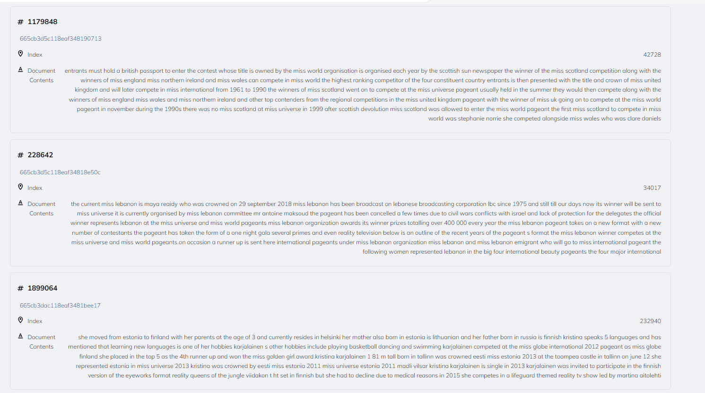
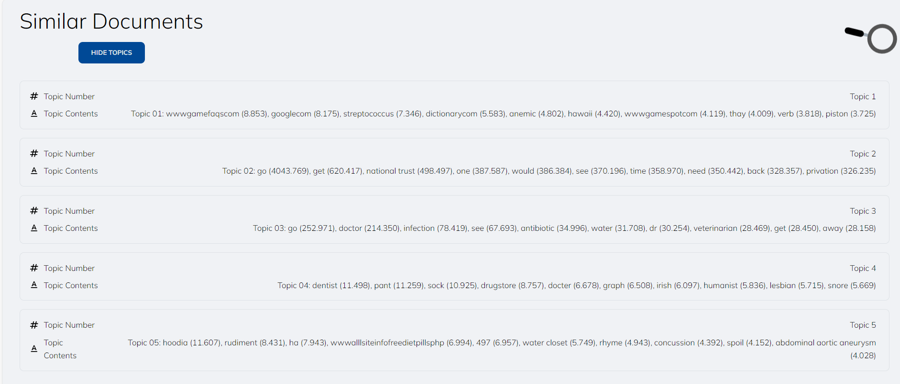
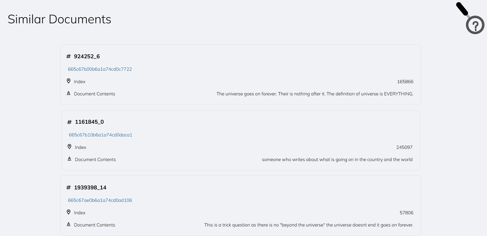

# Advanced Search Engine Project

## Project Overview

This project, developed as an assignment for the Information Retrieval subject, demonstrates the implementation of search engines using two distinct techniques: TF-IDF based vectorization and embedding-based vectorization. Our goal is to showcase efficient and accurate document retrieval in response to user queries, highlighting the differences and advantages of each approach.

## Features

- Dual search engine implementation: TF-IDF and Word Embedding based
- Query suggestion functionality
- Document clustering and topic detection
- Similar document retrieval
- Efficient offline processing and fast online querying

## Technologies Used

- **Python**: Primary programming language
- **NumPy**: For numerical computations
- **Chroma DB**: Vector database for efficient similarity search
- **Gensim**: For Word2Vec model implementation
- **Scikit-learn**: For TF-IDF vectorization and other machine learning utilities
- **FastAPI**: For creating the web API
- **NLTK**: For text processing and tokenization

## Datasets

- **Antique**: A non-factoid question answering dataset [Link](https://ir-datasets.com/antique.html#antique/train)
- **Wikipedia**: A subset of Wikipedia articles [Link](https://ir-datasets.com/wikir.html#wikir/en1k/training)

## Process Workflow

### TF-IDF Based Search Engine

| Process | Description |
|---------|-------------|
| Offline Process | 1. Load and preprocess documents 2. Create vocabulary 3. Compute TF-IDF matrix 4. Store TF-IDF matrix and vocabulary |
| Online Process | 1. Receive user query 2. Preprocess query 3. Convert query to TF-IDF vector 4. Compute similarity with document vectors 5. Rank and return top results |

### Word2Vec Based Search Engine

| Process | Description |
|---------|-------------|
| Offline Process | 1. Load and preprocess documents 2. Train or load pre-trained Word2Vec model 3. Compute document embeddings 4. Store embeddings in Chroma DB |
| Online Process | 1. Receive user query 2. Preprocess query 3. Compute query embedding 4. Perform similarity search in Chroma DB 5. Rank and return top results |

## Implementation Details

### TF-IDF Based Vectorization

The TF-IDF (Term Frequency-Inverse Document Frequency) approach involves:
- Creating a vocabulary from all documents
- Computing TF-IDF scores for each term in each document
- Representing documents and queries as TF-IDF vectors
- Using cosine similarity to find relevant documents

### Embedding-Based Vectorization

The Word Embedding approach involves:
- Using pre-trained or custom-trained Word2Vec models
- Representing words as dense vectors
- Computing document embeddings by averaging word vectors
- Using vector similarity in embedding space to find relevant documents

## Examples

| Query Suggestion | Query Result |
|------------------|--------------|
|  |  |

| Topic Detection | Similar Documents |
|-----------------|-------------------|
|  |  |

## Performance Comparison

| Metric | TF-IDF Based | Word Embedding Based |
|--------|--------------|----------------------|
| MAP    | 54%          | 70%                  |
| MRR    | 63%          | 80%                  |

The Word Embedding based approach shows superior performance in both Mean Average Precision (MAP) and Mean Reciprocal Rank (MRR) metrics.

## Additional Features

### Query Suggestion

Our system provides query suggestions based on:
1. Processing the user's input query
2. Generating word vectors using Word2Vec
3. Finding similar terms using cosine similarity
4. Ranking and presenting the top suggestions

### Documents Clustering

We implement document clustering to group similar documents and identify topics:
- Using K-Means clustering algorithm
- Applying Latent Dirichlet Allocation (LDA) for topic modeling

## How to Use

[To be added in a future update]

## Future Improvements

- Implement more advanced embedding models (e.g., BERT, GPT)
- Enhance query suggestion with user interaction data
- Improve clustering algorithms for better topic detection
- Optimize performance for larger datasets

## Contributors

- [Alaa Aldeen Zamel](https://github.com/alaazamelDev)
- Anas Rish
- Anas Durra
- Mohammed Hadi Barakat
- Mohammed Fares Dabbas

## License

[License information if applicable]
